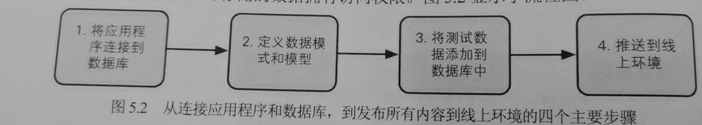

# MEAN

Node.js & Express & MongoDB & Angular

**博客引擎需求**

**管理员页面**

使用REST API 与Angular 单页面进行交互

**博客日志使用混合架构**

## 整体规划应用程序

启动->迭代改进->直到满意

1.将视图组件封装成集合

2.应用程序的架构

+ 从API开始

  

+ 架构选择

**将所有内容封装到Express项目中**

------

### 阶段

一、静态网站

快速确定布局

确保用户流程合理

二、设计数据模型并创建数据库

根据需求定义数据模型

三、建立数据API

REST API 允许应用程序与数据库交互

四、让应用程序与API通信

五、优化应用

### Express MVC

模型持有数据，控制器处理数据，视图渲染处理后的数据

### Express 路由

页面与URL的映射关系

### 构建前端模板

### Mongoose

### RESTful URL

+ 创建新条目
+ 读取包含多个条目的列表
+ 读取特定条目
+ 更新特定条目
+ 删除特定条目

创建 app_api文件夹 -> 路由、控制、模型

json

### 内部API 交互

request

### 前端集成Angular

#### 优化

解耦出 常用的类 单独定义